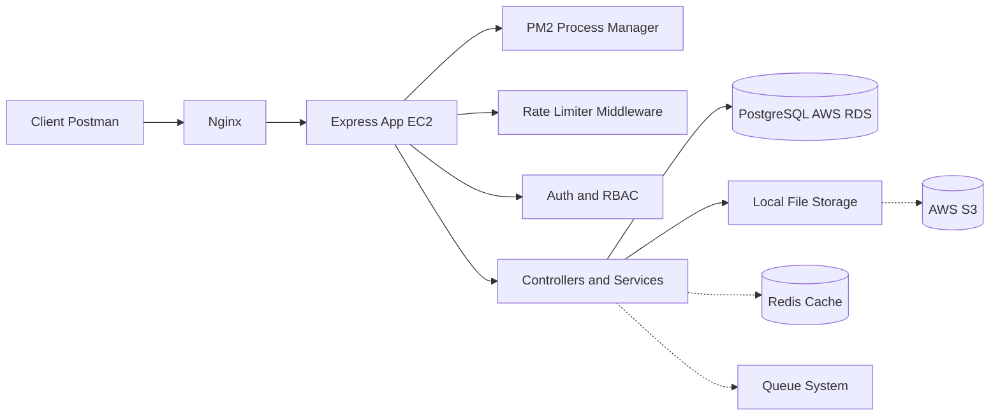

# 📡 Content Broadcasting System (Backend)


Hi, I'm **Anubhav** 👋
This project is a **production-style backend system** built with **Express.js** that enables:

* Teachers → Upload content
* Principals → Approve or reject content
* Students → Access scheduled content via public APIs

---

# 🧠 System Overview

This system simulates a **real-world educational content broadcasting platform** with:

* Authentication and RBAC
* Content lifecycle management
* Subject-based scheduling and rotation
* Public content delivery API
* Edge case handling

---

# 🏗️ Architecture Diagram



---

# 🚀 Tech Stack

* **Backend:** Express.js (Node.js)
* **Database:** AWS RDS (PostgreSQL)
* **Deployment:** AWS EC2
* **Process Manager:** PM2
* **Reverse Proxy:** Nginx
* **Authentication:** JWT + RBAC
* **Security:** Rate Limiting

---

# 🌐 Deployment Architecture

* Application deployed on **AWS EC2**
* **Nginx** used as reverse proxy for handling traffic
* **PM2** used for process management and uptime
* **AWS RDS PostgreSQL** used as managed database

---

# ⚙️ Core Features

* 🔐 JWT Authentication + Role-Based Access Control
* 📤 Content Upload (JPG, PNG, GIF)
* ✅ Approval Workflow (Principal controlled)
* 📡 Public Broadcasting API
* ⏱️ Subject-based Scheduling and Rotation
* 🚫 Edge Case Handling (no content, invalid subject, etc.)
* 🛡️ Rate Limiting for API protection

---

# 🔄 Workflow

```text
Teacher → Upload Content → Pending
Principal → Approve or Reject
Approved Content → Scheduled
Public API → Serves Active Content
```

---

# 📁 Project Structure

```bash
src/
│── controllers/
│── routes/
│── services/
│── middlewares/
│── models/
│── utils/
```

---

# 📚 API Documentation

* API documentation link has been **submitted via assignment form**
* Postman collection is **included in this repository**
* Live API link also **submitted via form**

👉 Use Postman environment variables to test APIs

---

# 🧪 Run Locally

## 🔑 Environment Variables

```env
DB_USER=postgres
DB_HOST=amazonaws.com
DB_NAME=postgres
DB_PASSWORD=
DB_PORT=5432

PORT=3000
JWT_SECRET=meme

DB_SSL_CERT=
```

## ▶️ Run Commands

```bash
npm install
npm run dev
```

---

# ⚠️ Limitations and Assumptions

* 📂 Files are stored in **local storage**

  * S3 integration can be added easily
* ⚡ Redis is **not implemented**

  * Could be used for caching frequent queries
* 🧱 Database indexing is not implemented
* 🔄 Queue system (Redis-based) not implemented but planned

---

# 🚀 Future Improvements

* ☁️ AWS S3 for file storage
* ⚡ Redis caching for performance optimization
* 🔁 Background job queues
* 📊 Analytics (subject usage, content tracking)
* 🧱 Database indexing and query optimization

---

# 🛡️ Security

* JWT-based authentication
* Role-based authorization (RBAC)
* Protected routes
* Input validation and error handling
* Rate limiting


---

# 🙌 Author

**Anubhav**


* turn this into a **perfect resume project description (1–2 lines)**
* or simulate a **real interview on this project** 🔥
